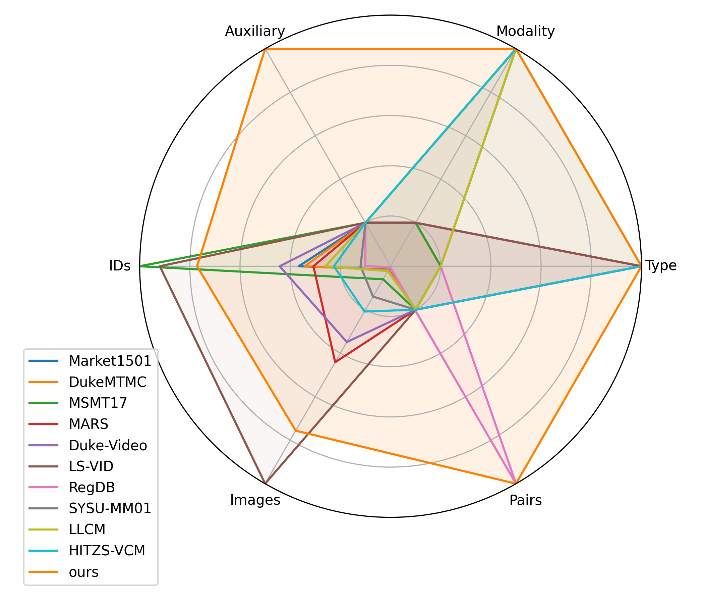
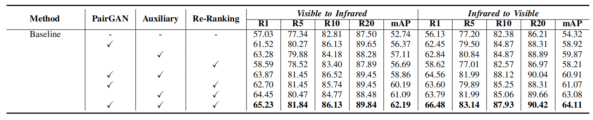
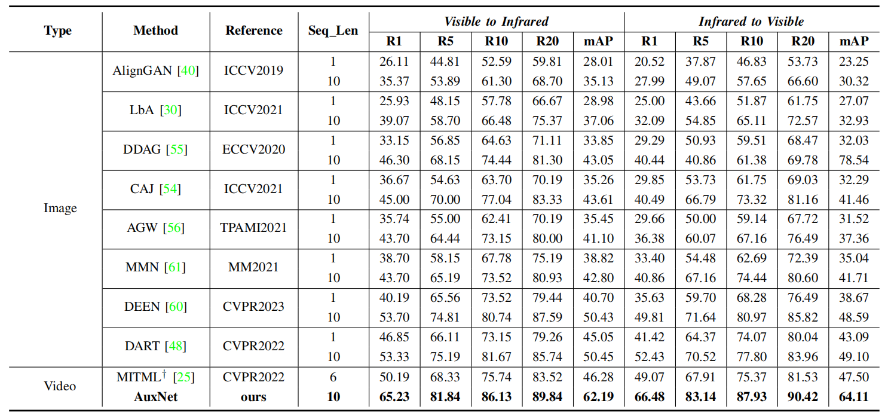

# BUPTCampus
BUPTCampus is a video-based visible-infrared dataset 
with approximately pixel-level aligned tracklet pairs
and single-camera auxiliary samples.

The [paper](https://ieeexplore.ieee.org/document/10335724) is accepted by **IEEE Transactions on Information Forensics & Security (TIFS)** 2023.



## Abstract 

Visible-infrared person re-identification (VI-ReID) aims to match persons captured by visible and infrared cameras, allowing person retrieval and tracking in 24-hour surveillance systems. Previous methods focus on learning from cross-modality person images in different cameras. However, temporal information and single-camera samples tend to be neglected. To crack this nut, in this paper, we first contribute a large-scale VI-ReID dataset named BUPTCampus. Different from most existing VI-ReID datasets, it 1) collects tracklets instead of images to introduce rich temporal information,  2) contains pixel-aligned cross-modality sample pairs for better modality-invariant learning, 3) provides one auxiliary set to help enhance the  optimization, in which each identity only appears in a single camera. Based on our constructed dataset, we present a two-stream framework as baseline and apply Generative Adversarial Network (GAN) to narrow the gap between the two modalities. To exploit the advantages introduced by the auxiliary set, we propose a curriculum learning based strategy to jointly learn from both primary and auxiliary sets. Moreover, we design a novel temporal k-reciprocal re-ranking method to refine the ranking list with fine-grained temporal correlation cues. Experimental results demonstrate the effectiveness of the proposed methods. We also reproduce 9 state-of-the-art image-based and video-based VI-ReID methods on BUPTCampus and our methods show substantial superiority to them. The codes and dataset are available at: https://github.com/dyhBUPT/BUPTCampus.

## Experiments





## Data Preparation

1\. Download BUPTCampus from [baidu disk](https://pan.baidu.com/s/1GlAlNoSWUuvaGPjOzK4jqQ?pwd=bupt). The file structure should be:
```
path_to_dataset
|—— DATA
|—— data_paths.json
|—— gallery.txt
|—— query.txt
|—— train.txt
|—— train_auxiliary.txt
```
It contains all training/testing/auxiliary samples with 3,080 identities.
Moreover, in additional to the original RGB/IR samples,
the fake IR samples generated by our PairGAN module are also provided.

2\. Set the paths of your dataset to `--data_root` in `opt.py`.

Please note that (License):
- The dataset is only for academic. Please don't use it for commercial use.
- Please don't redistribute the dataset.
- Please cite our paper if you use the dataset.

By downloading our dataset, you agree to be bound by and comply with the license agreement.

## Requirements
- torch==1.11.0
- torchvision==0.12.0
- tensorboard==2.10.0
- numpy==1.23.1
- Pillow==7.1.2

## Test
For direct testing, please download our prepared checkpoints and extracted features from 
[baidu disk](https://pan.baidu.com/s/17yfHjKDhUevtfPLdgTMrNw?pwd=bupt).

#### 1) Baseline

Then run the following command to load the checkpoint, and you will get the results of baseline.
```shell script
python test.py --test_ckpt_path path/ckpt/ckpt_res34_real.pth
```

#### 2) AuxNet

To reproduce the reported performance of AuxNet, 
you can directly use the following command to perform re-ranking based on our extracted features.
```shell script
python re_ranking.py --test_feat_path path/feat
```

If you want to extract all these features by yourself, please use the following commands:
```shell script
python test.py --test_ckpt_path path/ckpt/ckpt_res34_real_auxiliary.pth --test_frame_sample uniform-first_half-second_half --feature_postfix _real-aux
python test.py --test_ckpt_path path/ckpt/ckpt_res34_fake_auxiliary.pth --test_frame_sample uniform-first_half-second_half --feature_postfix _fake-aux --fake
```
Then run `re_ranking.py`,  and you will get the final metrics of AuxNet.

## Train

#### 1) Baseline
You can train our baseline module by:
```shell script
python train.py --gpus 0,1
```

#### 2) AuxNet
To get the full AuxNet model, you should train the model twice.
First, you should train `real RGB` & `real IR` samples with auxiliary learning by:
```shell script
python train.py --gpus 0,1 --auxiliary
```
Then you will get the checkpoints corresponding to the provided `ckpt_res34_real_auxiliary.pth`

Second, you should train `fake IR` & `real IR` samples with auxiliary learning by:
```shell script
python train.py --gpus 0,1 --auxiliary --fake
```
Then you will get the checkpoints corresponding to the provided `ckpt_res34_fake_auxiliary.pth`

Finally, for evaluation, please refer to the `Test` section above (feature extraction + re_ranking).

## Citation
```
@ARTICLE{10335724,
  author={Du, Yunhao and Lei, Cheng and Zhao, Zhicheng and Dong, Yuan and Su, Fei},
  journal={IEEE Transactions on Information Forensics and Security}, 
  title={Video-Based Visible-Infrared Person Re-Identification With Auxiliary Samples}, 
  year={2024},
  volume={19},
  number={},
  pages={1313-1325},
  doi={10.1109/TIFS.2023.3337972}}
```

## Acknowledgement
A large part of codes are borrowed from 
[DDAG](https://github.com/mangye16/DDAG) and [FastReID](https://github.com/JDAI-CV/fast-reid).
Thanks for their excellent work!
